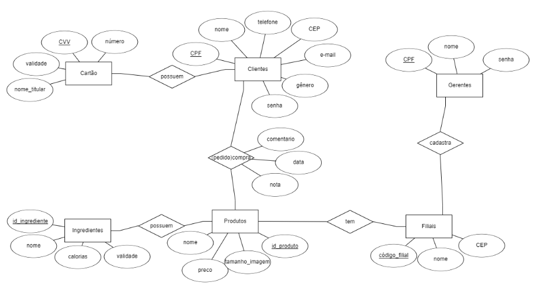
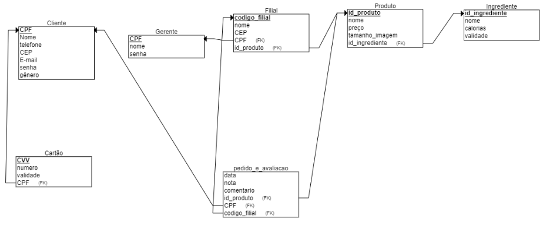

# Projeto de Banco de dados para o Food FEI
Esse projeto serve como uma continuação do repositório "Proj_FoodFEI".
O objetivo desse projeto é implementar um sistema de banco de dados para o  aplicativo de drive-thru Food FEI. O sistema deve ser capaz de armazenar e gerenciar informações relacionadas a clientes, gerentes, filiais, produtos, cartões dos clientes e ingredientes dos produtos, bem como as relacções entre as entidades (descritas no repositório "Proj_FoodFEI" como "comprar produto, avaliar pedido...

# integrantes do grupo:

-Beatriz Manaia Lourenço Berto RA: 22.125.060-8

-Laura de Souza Parente RA:22.123.033-7

# Como executar o projeto:
-abre o supabase (https://supabase.com/)e em "SQL Editor" coloque a primeira DDL abaixo, em seguida clique em "run"

-após rodar a primeira DDL, no supabase, em "SQL editor" rode a segunda que está logo abaixo para fazer o relacionamento das tabelas que dependem uma da outra (como departamento na tabela professor)

-no replit coloque o código commitado nesse projeto (código esse que serve tanto para: gerar, inserir e validar dados na tabela) antes de rodar, coloque sua supabaseUrl e supabaseKey no código

-execute as queries abaixo para verificar o funcionamento do projeto

# Modelo Entidde Relacionamento 



# Modelo Relacional na 3FN



# DDL

```sql
-- Apagar todas as tabelas considerando dependências
drop table if exists gerente cascade;
drop table if exists filial cascade;
drop table if exists cliente cascade;
drop table if exists cartao cascade;
drop table if exists produto cascade;
drop table if exists ingrediente cascade;
drop table if exists pedido_e_avaliacao cascade;
drop table if exists produtoIngrediente;
drop table if exists filialProduto;
--criar tabelas

create table cartao
    (cvv	text, 
    numero	text, 
    validade text,
   --cpf titular como chave estrangeira
    primary key (cvv)
    );

create table cliente
    (cpf_cliente	text, 
    nome_cliente	text, 
    senha text,
    telefone text,
    cep text,
    email text,
    genero text,
    primary key (cpf_cliente)
    );

create table gerente
    (cpf_gerente	text, 
    nome_gerente	text, 
    senha text,
    primary key (cpf_gerente)
    );

create table ingrediente
    (id_ingrediente	text, 
    nome_ingrediente text, 
    calorias text,
    validade text,
    preço float,
    primary key (id_ingrediente)
    );

create table produto
    (id_produto	text, 
    nome_produto	text, 
    preco float,
    tamanho_imagem text,
    primary key (id_produto)
    );

 create table filial
  (codigo_filial text,
   nome_filial text,
   cep text,
   cpf_gerente text,
  foreign key (cpf_gerente) references gerente (cpf_gerente),
  primary key(codigo_filial)
  );
  
  create table filialProduto
    (id_produto text,
     codigo_filial text,
    foreign key (id_produto) references produto (id_produto),
    foreign key (codigo_filial) references filial (codigo_filial)
    );


    create table pedido_e_avaliacao
    (data date, 
    nota float, 
    comentario text,
    id_produto text,
    cpf_cliente text,
    codigo_filial text,
    foreign key (id_produto) references produto (id_produto),
    foreign key (cpf_cliente) references cliente (cpf_cliente),
    foreign key (codigo_filial) references filial (codigo_filial)
    );

    create table produtoIngrediente
    (quantidade_ingrediente float,
    id_produto text,
    id_ingrediente text,
    unidade_de_medida text,
    foreign key (id_produto) references produto (id_produto),
    foreign key (id_ingrediente) references ingrediente (id_ingrediente)
    );

ALTER TABLE cartao 
ADD COLUMN cpf_titular TEXT REFERENCES cliente(cpf_cliente);

```
# QUERIES
```sql
--1)listar todos os ingredientes de algum produto 
SELECT nome_ingrediente, nome_produto --o que quero mostrar fica no select (tabelas que tem esses dadoa no from ou joins)
FROM ingrediente
INNER JOIN produtoingrediente ON produtoingrediente.id_ingrediente = ingrediente.id_ingrediente
INNER JOIN produto ON produto.id_produto = produtoingrediente.id_produto
WHERE produto.id_produto = '18672'; --ir na tabela de produto e pegar algum id

--2)listar todos os cliente (por cpf) que tem mais de 2 cartões 

--GROUP BY / HAVING 
--o nome que aparece apos o group by tem que ta no select, se desejo mostra mais de uma coisa tenho que fazer uma subquery 
--usa groupby quando faz agregação ex: count,sum,avg..
--após o groupby usa having para filtrar os resultados de funções de agregação (COUNT, SUM, AVG..)

--ex:
--SELECT cliente.cpf_cliente --o que quero mostrar fica no select (tabelas que tem esses dadoa no frm ou joins)
--FROM cliente 
--INNER JOIN cartao ON cartao.cpf_titular = cliente.cpf_cliente
--GROUP BY cliente.cpf_cliente --GROUP BY coloca as colunas pelas quais quer agrupar os dados.
--HAVING COUNT(cartao.numero) > 2; --todos os cpf_cliente que aparecem +2x ( having aplica filtro no gorup by, >2 é aplicado no cpf titular que ta no gorup by)

--porem desejo mostrar cpf do cliente e numero de seus cartoes entao:

--quantos clientes avaliaram +2 cartoes
--SELECT  COUNT(DISTINCT cliente.cpf_cliente) AS qtd_clientes_com_mais_de_2_cartoes 
--FROM cliente 
--INNER JOIN cartao ON cartao.cpf_titular = cliente.cpf_cliente
--WHERE cliente.cpf_cliente IN (
--  SELECT cartao.cpf_titular
--  FROM cartao
--  GROUP BY cartao.cpf_titular --GROUP BY coloca as colunas pelas quais quer agrupar os dados.
--  HAVING COUNT(cartao.numero) > 2
--)

--SELECT  cliente.cpf_cliente, cartao.numero
--FROM cliente 
--INNER JOIN cartao ON cartao.cpf_titular = cliente.cpf_cliente
--WHERE cliente.cpf_cliente IN (
--  SELECT cartao.cpf_titular
--  FROM cartao
--  GROUP BY cartao.cpf_titular --GROUP BY coloca as colunas pelas quais quer agrupar os dados.
--  HAVING COUNT(cartao.numero) > 2
--)

SELECT cliente.cpf_cliente, COUNT(cartao.numero)
FROM cliente
INNER JOIN cartao ON cartao.cpf_titular = cliente.cpf_cliente
GROUP BY cliente.cpf_cliente
HAVING COUNT(cartao.numero) > 2

--WHERE IN	Filtrar por uma lista de valores (quero mostrar todos os clientes que tem mais de 2 cartoes, filtro isso no where)
--counts
--COUNT(*)Conta todas as linhas, independente se tem `NULL` ou não
--COUNT(coluna)Conta somente os valores não-nulos daquela coluna                  
--COUNT(DISTINCT coluna) Conta valores únicos (sem repetir) de uma coluna, ignorando `NULL`


--3)listar o nome do ingrediente mais usado em produtos no geral (e quantos foi usado no total)c
SELECT ingrediente.nome_ingrediente, COUNT(produtoingrediente.id_ingrediente) AS quantidade_usada --conta quantas vezes cada ingrediente foi usado em produtos
FROM ingrediente
INNER JOIN produtoingrediente ON ingrediente.id_ingrediente = produtoingrediente.id_ingrediente
GROUP BY ingrediente.nome_ingrediente --ordena pelo nome
ORDER BY quantidade_usada DESC --ordenada colocando o ingrediente mais usado
LIMIT 1; --faz aparecer só um ingrediente

--4)quais as filiais de cada gerente  
--da para fazer com strng_agg mas assim foi mais intuitivo para mim 
SELECT filial.nome_filial, gerente.nome_gerente
FROM filial 
INNER JOIN gerente ON gerente.cpf_gerente = filial.cpf_gerente --q mudaria se fizesse left join
ORDER BY gerente.nome_gerente DESC

--5)mostre o nome da filial que mais vendeu produtos e a quantidade de produtos vendida 
SELECT pedido_e_avaliacao.codigo_filial, COUNT(pedido_e_avaliacao.id_produto) AS quantidade_produto
FROM pedido_e_avaliacao
GROUP BY (pedido_e_avaliacao.codigo_filial)
ORDER BY quantidade_produto DESC
LIMIT 1;  --sempre que quiser o "mais" ou "menos" algo uo order by e pego primeiro

--6)qual os ingrediente mais usados no total das filiais em ordem descrescente
SELECT ingrediente.nome_ingrediente, COUNT(filialProduto.codigo_filial) AS quantidade_produto
FROM ingrediente 
INNER JOIN produtoingrediente ON produtoingrediente.id_ingrediente = ingrediente.id_ingrediente
INNER JOIN produto ON produtoingrediente.id_produto = produto.id_produto
INNER JOIN filialProduto ON filialProduto.id_produto = produto.id_produto--aplicar todos os filtros juntos
GROUP BY ingrediente.nome_ingrediente
ORDER BY quantidade_produto DESC
--LIMIT 1; (mostra só  o mais usado)


--7)quantas/quais as filiais de cada gerente 
SELECT gerente.nome_gerente, COUNT(filial.cpf_gerente), STRING_AGG(filial.nome_filial, ',') 
FROM gerente
INNER JOIN filial ON filial.cpf_gerente = gerente.cpf_gerente
GROUP BY 1 --gerente.nome_gerente

--stringagg -> array de filial (todas as filiais do select coloca ai)

--quantas filiais cada gerente tem

--SELECT gerente.nome_gerente, COUNT(filial.cpf_gerente)
--FROM gerente
--INNER JOIN filial ON filial.codigo_filial = gerente.cpf_gerente
--GROUP BY 1 --gerente.nome_gerente

--8)mostre em ordem as filiais que mais tem produtos e a quantidade de produtos 
SELECT filial.nome_filial, COUNT(filialProduto.id_produto) AS total_produtos_vendido_por_filial
FROM filial
INNER JOIN filialproduto ON filialproduto.codigo_filial = filial.codigo_filial
GROUP BY filial.nome_filial
ORDER BY  total_produtos_vendido_por_filial DESC
--LIMIT 1; --mostra so A que mais vendeu

--9)mostre a filial com maior nota de avaliacao
SELECT filial.nome_filial, AVG(pedido_e_avaliacao.nota) AS media_notas --avg media de notas 
FROM filial
INNER JOIN pedido_e_avaliacao ON pedido_e_avaliacao.codigo_filial = filial.codigo_filial
GROUP BY filial.nome_filial
ORDER BY media_notas DESC 
LIMIT 1

--mostra filiais com nota de avaliacao = 5
--SELECT filial.nome_filial, pedido_e_avaliacao.nota
--FROM filial
--INNER JOIN pedido_e_avaliacao ON pedido_e_avaliacao.codigo_filial = filial.codigo_filial
--WHERE pedido_e_avaliacao.nota = 5

--10)listar todos os produtos que contém um ingrediente específico e quanto tem desse ingrediente tem por produto 
SELECT produto.nome_produto, COUNT(ingrediente.id_ingrediente)
FROM produto
INNER JOIN produtoingrediente ON produtoingrediente.id_produto = produto.id_produto
INNER JOIN ingrediente ON ingrediente.id_ingrediente = produtoingrediente.id_ingrediente
WHERE ingrediente.id_ingrediente = '10334'
GROUP BY 1

--11)listar a quantidade de produtos cada cliente avaliou (= a query de quantos ingredientes cada produto tem)
SELECT pedido_e_avaliacao.cpf_cliente, COUNT(pedido_e_avaliacao.id_produto) AS quantidade_de_produtos_avaliados
FROM pedido_e_avaliacao
GROUP BY 1
ORDER BY quantidade_de_produtos_avaliados DESC

--12)mostrar a média das notas por produto avaliado 
SELECT produto.nome_produto, AVG(pedido_e_avaliacao.nota) AS mdida_avaliacao_produto
FROM pedido_e_avaliacao
INNER JOIN produto ON produto.id_produto = pedido_e_avaliacao.id_produto
GROUP BY 1

--13)produtos mais caros que a media de preço e a filial desse produto 
SELECT  produto.nome_produto, produto.preco, filial.nome_filial
FROM produto
INNER JOIN filialproduto ON produto.id_produto = filialproduto.id_produto
INNER JOIN filial ON filialproduto.codigo_filial = filial.codigo_filial

--14)WHERE produto.preco > AVG(produto.preco) --fazer uma sub query que retorna o avg e usar isso no where, NAO PODE USAR AVG DIRETAMENTE NO WHERE
WHERE produto.preco > (
  SELECT AVG(produto.preco) 
  FROM produto
  )

--15)produto mais caro de alguma filial (soma da nota dos ingredientes por produto)  


--16)Total gasto por cliente (soma dos preços dos produtos que ele avaliou) 
--17)clientes que fizeram pedido em mais de uma filial 
--18)filiais com mais de 1 produto avaliado (garantir isso no código)


-- LEFT JOIN quando  quer manter todas as linhas da tabela da esquerda, mesmo que não haja correspondência na tabela da direita e mostrar NULL nos campos da tabela da direita quando não houver correspondência.

--ex: na produto com todos os produtos cadastrados, tabela pedido_e_avaliacao com apenas os produtos que foram avaliados, quero ver todos os produtos, mesmo os que nunca foram avaliados, com a média das notas (se existirem), use LEFT JOIN:

--SELECT     produto.nome_produto,     AVG(pedido_e_avaliacao.nota) AS media_avaliacao
--FROM   produto
--LEFT JOIN   pedido_e_avaliacao ON produto.id_produto = pedido_e_avaliacao.id_produto
--GROUP BY  produto.nome_produto;

```