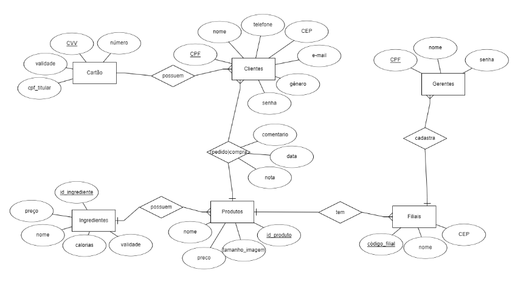
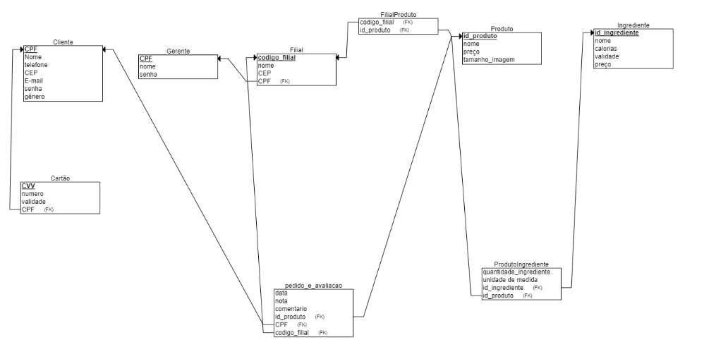

# Projeto de Banco de dados para o Food FEI
Esse projeto serve como uma continuação do repositório "Proj_FoodFEI".
O objetivo desse projeto é implementar um sistema de banco de dados para o  aplicativo de drive-thru Food FEI. O sistema deve ser capaz de armazenar e gerenciar informações relacionadas a clientes, gerentes, filiais, produtos, cartões dos clientes e ingredientes dos produtos, bem como as relacções entre as entidades (descritas no repositório "Proj_FoodFEI" como "comprar produto, avaliar pedido...

# integrantes do grupo:

-Beatriz Manaia Lourenço Berto RA: 22.125.060-8

-Laura de Souza Parente RA:22.123.033-7

# Como executar o projeto:
-abre o supabase (https://supabase.com/)e em "SQL Editor" coloque a primeira DDL abaixo, em seguida clique em "run"

-após rodar a primeira DDL, no supabase, em "SQL editor" rode a segunda que está logo abaixo para fazer o relacionamento das tabelas que dependem uma da outra (como departamento na tabela professor)

-no replit coloque o código commitado nesse projeto (código esse que serve tanto para: gerar, inserir e validar dados na tabela) antes de rodar, coloque sua supabaseUrl e supabaseKey no código

-execute as queries abaixo para verificar o funcionamento do projeto

# Modelo Entidde Relacionamento 



# Modelo Relacional na 3FN



# DDL

```sql
-- Apagar todas as tabelas considerando dependências
drop table if exists gerente cascade;
drop table if exists filial cascade;
drop table if exists cliente cascade;
drop table if exists cartao cascade;
drop table if exists produto cascade;
drop table if exists ingrediente cascade;
drop table if exists pedido_e_avaliacao cascade;
drop table if exists produtoIngrediente;
drop table if exists filialProduto;
--criar tabelas

create table cartao
    (cvv	text, 
    numero	text, 
    validade text,
   --cpf titular como chave estrangeira
    primary key (cvv)
    );

create table cliente
    (cpf_cliente	text, 
    nome_cliente	text, 
    senha text,
    telefone text,
    cep text,
    email text,
    genero text,
    primary key (cpf_cliente)
    );

create table gerente
    (cpf_gerente	text, 
    nome_gerente	text, 
    senha text,
    primary key (cpf_gerente)
    );

create table ingrediente
    (id_ingrediente	text, 
    nome_ingrediente text, 
    calorias text,
    validade text,
    preço float,
    primary key (id_ingrediente)
    );

create table produto
    (id_produto	text, 
    nome_produto	text, 
    preco text,
    tamanho_imagem text,
    primary key (id_produto)
    );

 create table filial
  (codigo_filial text,
   nome_filial text,
   cep text,
   cpf_gerente text,
  foreign key (cpf_gerente) references gerente (cpf_gerente),
  primary key(codigo_filial)
  );
  
  create table filialProduto
    (id_produto text,
     codigo_filial text,
    foreign key (id_produto) references produto (id_produto),
    foreign key (codigo_filial) references filial (codigo_filial)
    );


    create table pedido_e_avaliacao
    (data date, 
    nota float, 
    comentario text,
    id_produto text,
    cpf_cliente text,
    codigo_filial text,
    foreign key (id_produto) references produto (id_produto),
    foreign key (cpf_cliente) references cliente (cpf_cliente),
    foreign key (codigo_filial) references filial (codigo_filial)
    );

    create table produtoIngrediente
    (quantidade_ingrediente float,
    id_produto text,
    id_ingrediente text,
    unidade_de_medida text,
    foreign key (id_produto) references produto (id_produto),
    foreign key (id_ingrediente) references ingrediente (id_ingrediente)
    );

ALTER TABLE cartao 
ADD COLUMN cpf_titular TEXT REFERENCES cliente(cpf_cliente);
```
